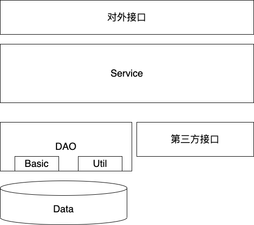
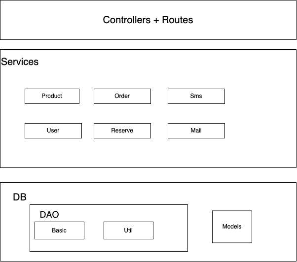

# node service

## 随笔

最大的疑问是，到底数据库要不要统一管理，如果统一管理，那就彰显不出服务自治的概念了

## 开篇（目的）

- 模块化，让开发人员只关注业务代码，减少配置
-
- 整体结构将入遵循如下

## todos

- 针对数据库 mongodb 的 做一层 DTO
- 针对 Koa 做对外一层的接口暴露，不纠结 http 细节。
  - 统一采用 get 和 post

## 使用形式

- 可能作为一个 bin 来使用
- install （KOA）install（mongodb）
