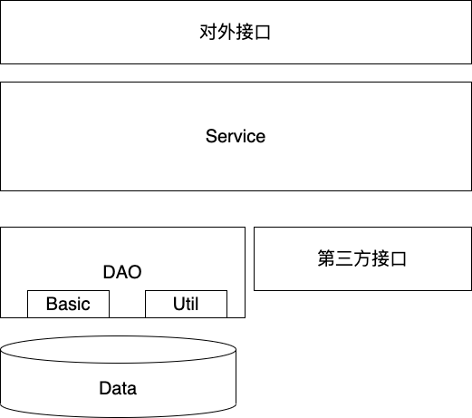
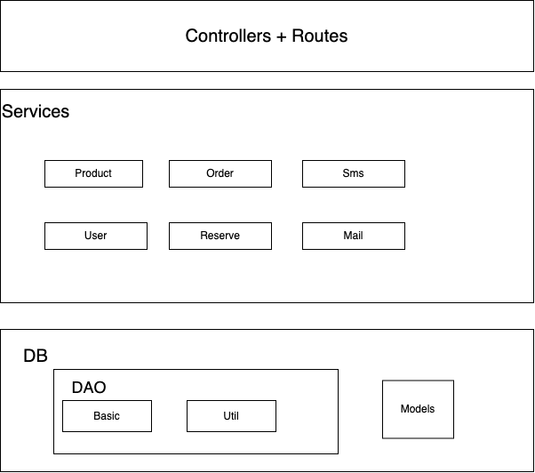

# 面向服务的后端

## 几个原则

- DAO 只允许自己的 Service 访问，其他 Service 要访问必须通过 Service
- 不同层之间不允许传递对应的模型
  - 比如数据层，不允许对外暴露个性的数据库操作方式，例如直接对外暴露一个 filter，筛选数据
  - 比如 Service 不允许接口为 ctx ，通过 controller 直接传入

## 单服务



## 多服务

多服务的目的，

- 在具备单个服务的完整功能前提下，
- 统一管理，同一类别的领域, 划分在一个目录下



## 参考目录结构

```js
├── src
│   ├── controllers
│   ├── routes
│   ├── services
│       ├── food
│       ├── user
│       ├── mail
│       ├── sms
│   │   └── order
│   └── db
│       ├── model
│       ├── util
│       └── basic
└── static
```
