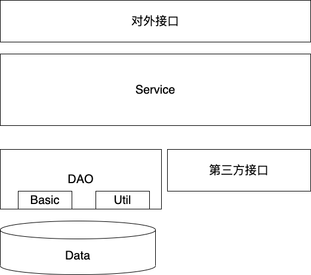

# node service

## src

**src 底下的服务将最终会变成一个 npm 库**

## 原则

- service 服务作用：**业务逻辑处理** **和数据组装**
- **DAO 只允许自己的 Service 访问**，其他 Service 要访问必须通过对应的 Service。
- 各领域模型不传递
- 一个 Service 对应 一个或者多个 DAO 待定，是否应该一个对一个
- 一个 Service 可以互相调用。可以采用消息队列来做？

-

## 随笔

- 不要认为任何业务逻辑可以做任何细粒度的拆解。从业务角度，一个业务是一个“步骤的集合”。总会有第一步干什么，第二步干什么，等等。很多时候，这些步骤写一起才更容易看懂，更容易修改和维护。

最大的疑问是，到底数据库要不要统一管理，如果统一管理，那就彰显不出服务自治的概念了

## 开篇（目的）

- 模块化，让开发人员只关注业务代码，减少配置
-
- 整体结构将入遵循如下

## todos

- 针对数据库 mongodb 的 做一层 DTO
- 针对 Koa 做对外一层的接口暴露，不纠结 http 细节。
  - 统一采用 get 和 post

## 使用形式

- 可能作为一个 bin 来使用
- install （KOA）install（mongodb）

## [业务逻辑区分](https://www.zhihu.com/question/66281499/answer/445712846)

更精细的区分，一个业务的逻辑大概可以分为两类：  
**业务直接相关的主逻辑**  
比如你要实现下单买东西，那么创建订单、扣款是主逻辑。这些逻辑必须要写到一起，而且往往用同一个事务包起来保证一致性。如果主逻辑非常复杂，就尝试用多个层级来拆解这些流程，但他们还是在一起。  
**业务辅助相关的逻辑**  
比如更新计数、更新 ES 的搜索数据、发一个业务统计 log 等。这些内容可以不要掺合到主逻辑中。可以用 AOP，事件队列（单机的/分布式的）的形式来解耦。

## 相关

- https://cloud.tencent.com/developer/article/1496900
- [前后端分离之 NodeJS+mysql 分层之美](https://www.jianshu.com/p/dab01487a9df)
